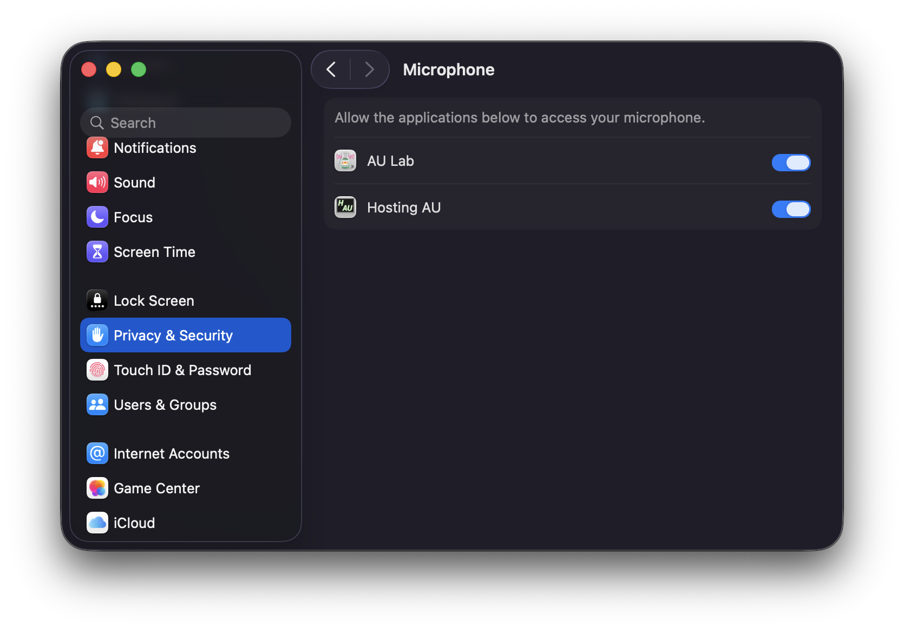
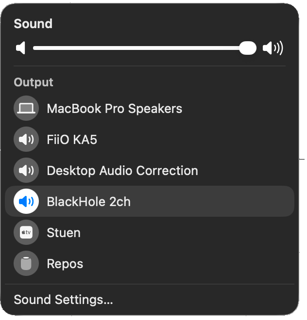
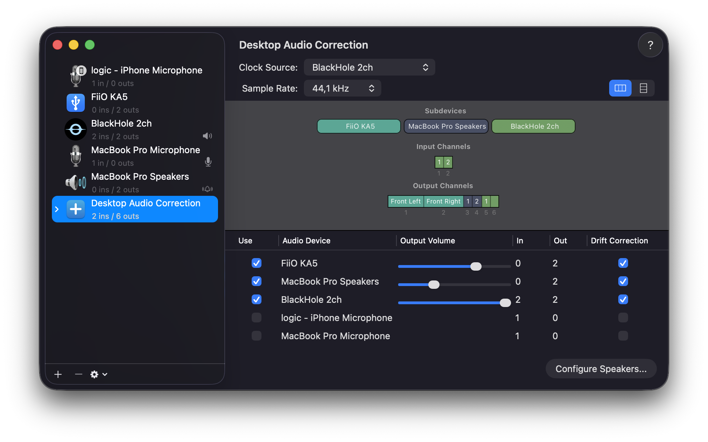
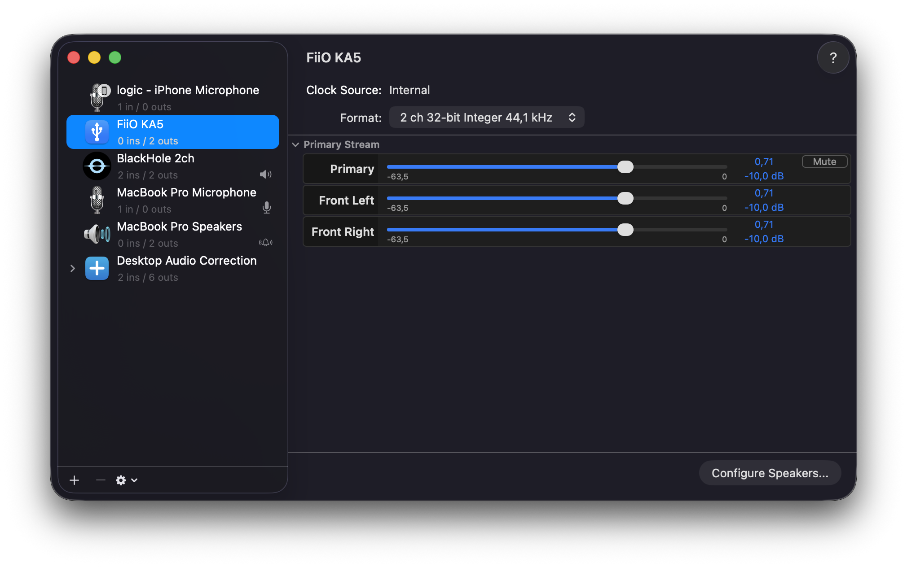
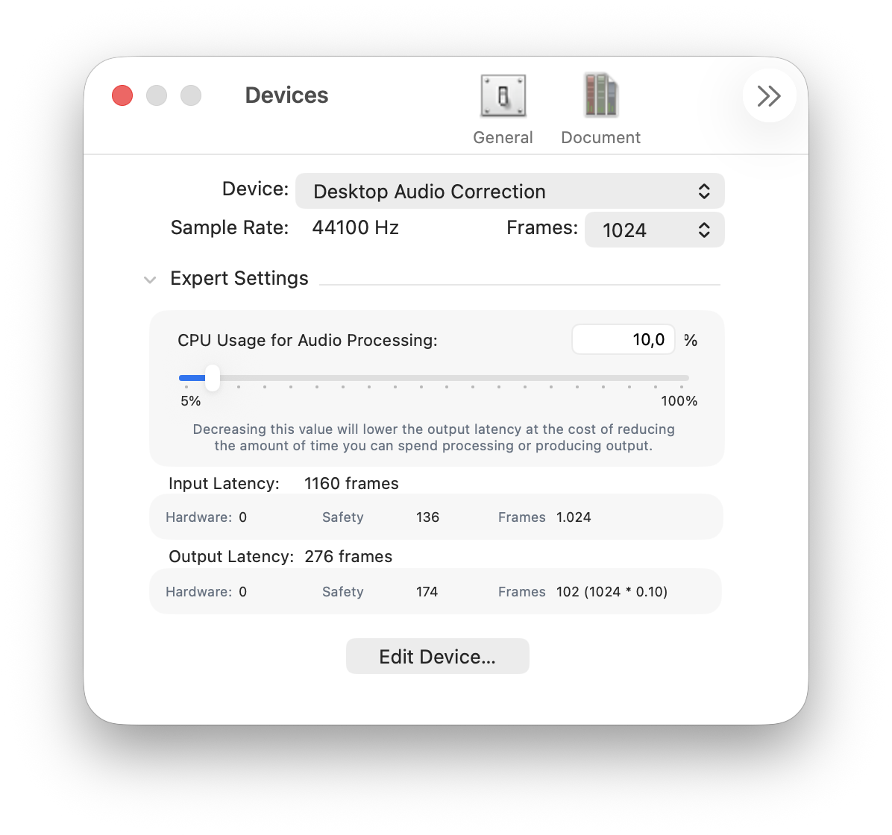
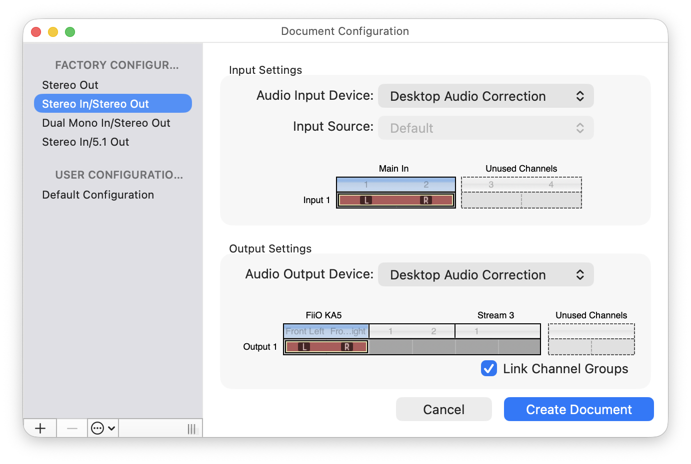
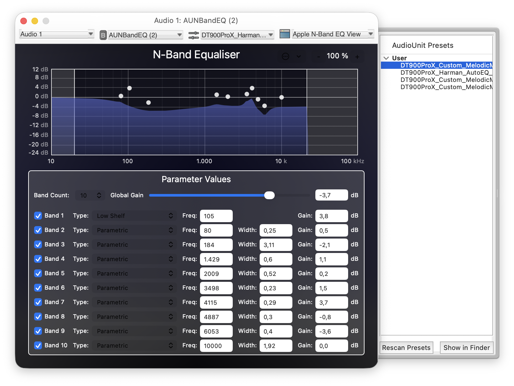
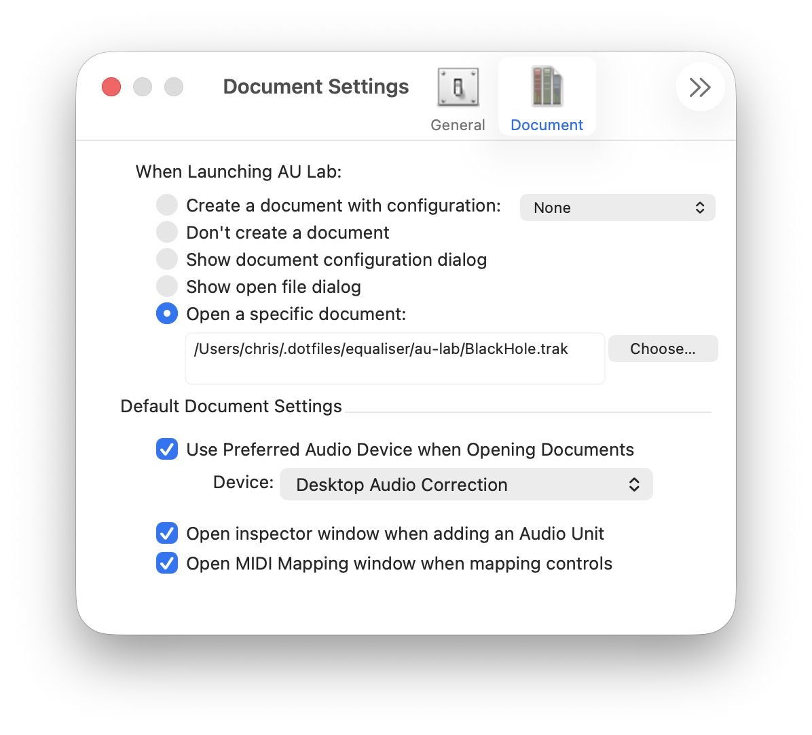

# AU Lab

Getting Apple **AU Lab** working on modern macOS (yes, even in 2026) is a bit of a chore—but it’s absolutely worth the effort.

This guide was written and tested on:

* **macOS Tahoe 26.2**
* **MacBook Pro M1**
* **AU Lab 2.3 (Apple Silicon)**
* **BlackHole 2ch**

## Installation

Apple still provides a download for [AU Lab (Intel)](https://www.apple.com/apple-music/apple-digital-masters/), but unfortunately that’s *only* the Intel build.

To get **AU Lab for Apple Silicon**, you need to download it via Apple’s developer tools:

* Go to the [Apple Developer Downloads](https://developer.apple.com/download/)
* Download **Additional Tools for Xcode**
* Extract **AU Lab.app** from that bundle

Once extracted, place **AU Lab.app** in the `/Applications` directory and launch it once.

### Microphone Access

On recent macOS versions, **AU Lab does not correctly request Microphone permissions** on its own.

You can verify this in:
**System Settings → Privacy & Security → Microphone**

To fix this, AU Lab needs a small manual tweak.

#### 1. Add a Microphone usage description

Right-click **AU Lab.app** → **Show Package Contents**, then open:

```
Contents → Info.plist
```

Add the following key:

```xml
<key>NSMicrophoneUsageDescription</key>
<string>Need microphone access for processing audio</string>
```

#### 2. Re-sign the application

After modifying the plist, AU Lab must be re-signed:

```sh
sudo codesign --force --deep --sign - "/Applications/AU Lab.app"
```

#### 3. Restart CoreAudio

```sh
sudo killall coreaudiod
```

#### 4. (Optional) Reset microphone permissions

If you made a mistake or AU Lab still doesn’t appear, reset all microphone permissions and try again:

```sh
tccutil reset Microphone
```

<br/>

#### 5. Verify permissions

Go back to:
**System Settings → Privacy & Security → Microphone**

AU Lab should now appear and be enabled:

<p align="left">
    
</p>

## Configuring AU Lab as a system-wide EQ

*Thanks to [clanger9](https://github.com/clanger9) for the excellent [original guide](https://github.com/ExistentialAudio/BlackHole/discussions/474) that this setup is based on.*

<br/>

### Install BlackHole

Install [BlackHole 2ch](https://github.com/ExistentialAudio/BlackHole).
In this setup, it’s installed via `nix-homebrew` as part of `darwin-rebuild`.

From the macOS menu bar, select **BlackHole 2ch** as your output device:

<p align="left">
    
</p>

### Create an Aggregate Device

1. Open **Audio MIDI Setup**
2. Click **+ → Create Aggregate Device**
3. Under **Use**, check:
   * **BlackHole 2ch**
   * Your speaker / DAC device(s)
4. Under **Drift Correction**, check **all devices**
   → **This is important** to prevent clicking and crackling after a few minutes
5. Rename the Aggregate Device to:
   **Desktop Audio Correction**

<p align="left">
    
</p>

### Adjust speaker levels

Click on your speaker / DAC device and reduce the channel volume to **-10 dB**:

<p align="left">
    
</p>

This gives you headroom and helps avoid clipping when EQ is applied.

### Configure AU Lab

Open **AU Lab**

Go to:
**AU Lab → Preferences → Devices**

* Select **Desktop Audio Correction**
* Set **Frames** to `1024`
* Under **Expert Settings**, set **CPU Usage** to `10%`

<p align="left">
    
</p>

### Create the processing document

Go to:
**File → New**

* Select **Stereo In / Stereo Out**
* Set **Desktop Audio Correction** as both **Input** and **Output**
* Click **Create Document**

<p align="left">
    
</p>

### Add EQ plugins

* For a classic graphic EQ, add **AUGraphicEQ**
* For room correction or precise tuning, **AUNBandEQ** is usually the better choice

<p align="left">
    
</p>

Save the document as **BlackHole**.

### Make AU Lab persistent

Go to:
**AU Lab → Preferences → Document**

* Enable **Open a specific document**
  * Select the **BlackHole** file you just saved
* Enable **Use Preferred Audio Device**
  * Select **Desktop Audio Correction**

<p align="left">
    
</p>

Finally:

* **AU Lab → Hide AU Lab** (`⌘H`)
* Right-click the AU Lab dock icon → **Options → Open at Login**

AU Lab will now act as a system-wide EQ every time you log in.

## Presets for Apple AU Lab

Place `.aupreset` files in:

* `~/Library/Audio/Presets/Apple/AUGraphicEQ`
* `~/Library/Audio/Presets/Apple/AUNBandEQ`

Presets will automatically appear inside AU Lab.

## Notes

> [!NOTE]
> **Using [Hosting AU](https://ju-x.com/hostingau.html)**
>
> * Hosting AU installs cleanly on modern macOS
> * It uses the same `.aupreset` files as AU Lab
> * It is a great tool to have if AU Lab is causing trouble

