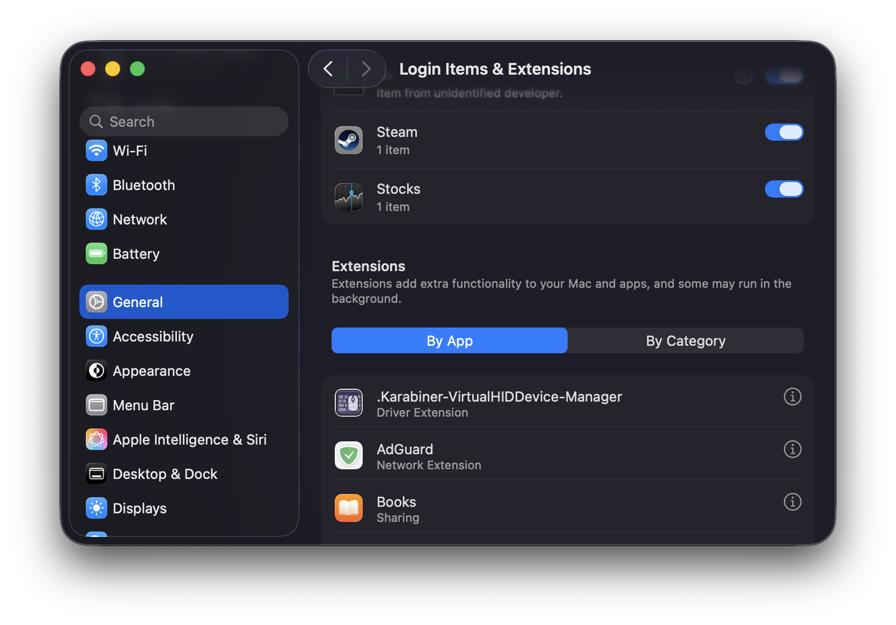
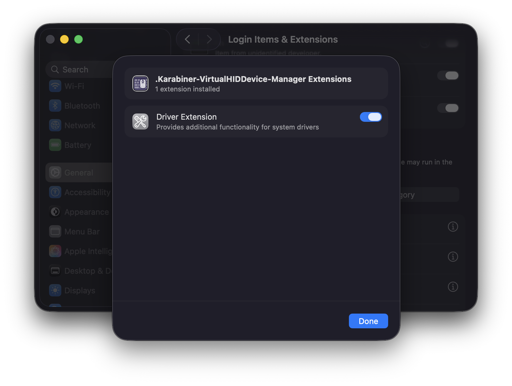
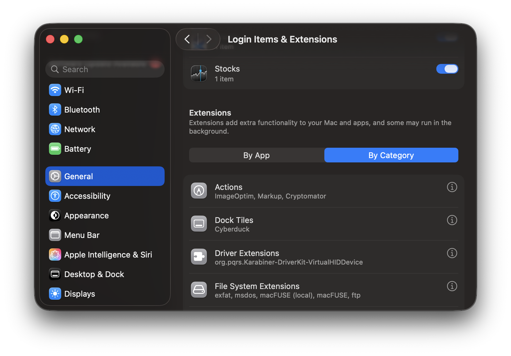
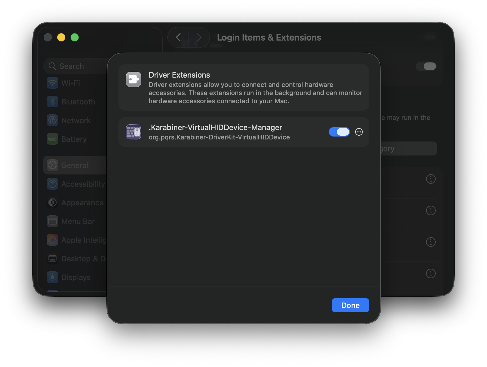
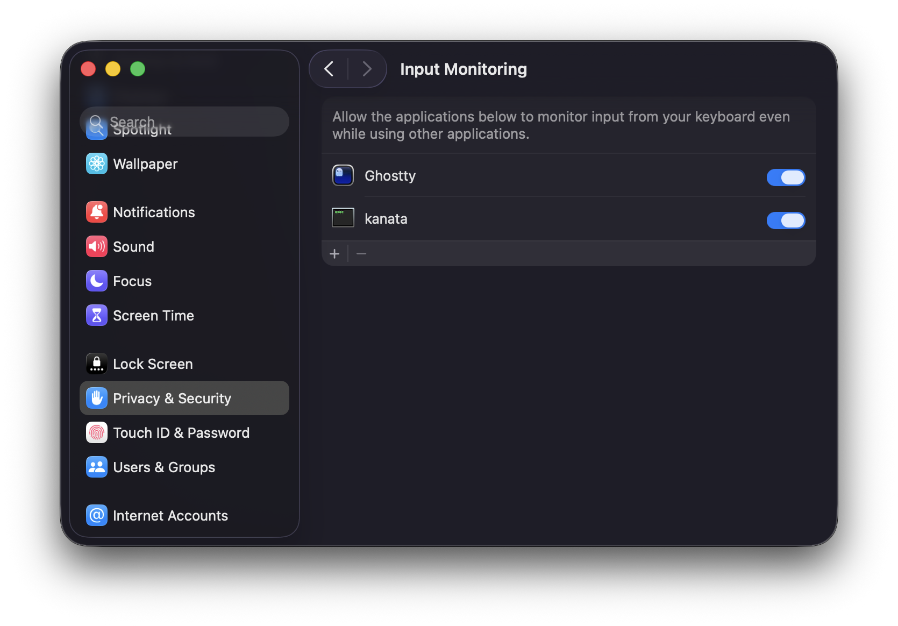

# `kanata`

Configuration for [kanata](https://github.com/jtroo/kanata)

## Install `kanata` binary

### Nix Install

The Nix install will install Kanata with Nix and set it up as system daemon

- NixOS: import `./kanata_install_nixos.nix` in `configuration.nix`
- macOS with nix-darwin: import `./kanata_install_darwin.nix` in `configuration.nix`

### Scripted Install

The scripted install will install Kanata with Cargo and set it up as system daemon

Go to the release page for [Kanata](https://github.com/jtroo/kanata/releases) and find the latest version  
Update the `./kanata_variables.sh` file with the details for the latest version

Then install it with:
``` bash
bash ./kanata_install.sh
```

### Manuan Install

Following the manual installation; you will install Kanata and install it as a system daemon

Go to the release page for [Kanata](https://github.com/jtroo/kanata/releases) and find the latest version

``` bash
git clone https://github.com/jtroo/kanata.git
```

Install Kanata with Cargo
``` bash
git checkout v<VERSION>
```

``` bash
cargo install --path <KANATA_CHECKOUT_DIR>
```

Configure host system for Kanata:
<details>
  <summary>For macOS</summary>

  #### Install Karabiner DriverKit

  Download and install the [`Karabiner-DriverKit-VirtualHIDDevice Driver`](https://github.com/pqrs-org/Karabiner-DriverKit-VirtualHIDDevice) that is specified for the Kanata version

  Activate it:
  ``` bash
  /Applications/.Karabiner-VirtualHIDDevice-Manager.app/Contents/MacOS/Karabiner-VirtualHIDDevice-Manager activate
  ```

  Launch the daemon:
  ``` bash
    sudo '/Library/Application Support/org.pqrs/Karabiner-DriverKit-VirtualHIDDevice/Applications/Karabiner-VirtualHIDDevice-Daemon.app/Contents/MacOS/Karabiner-VirtualHIDDevice-Daemon'
  ```

  Verify that `.Karabiner-VirtualHIDDevice-Manager` has been activated  
  Under: Settings > General > Login Items & Extensions  
  Check that `.Karabiner-VirtualHIDDevice-Manager` is listed under `Extensions` and that it is activated  
  - If it is not listed there, the `.Karabiner-VirtualHIDDevice-Manager` driver must be uninstalled and installed again.  
    It may be necessary to reboot between uninstall and install, to trigger the prompt that allows `.Karabiner-VirtualHIDDevice-Manager` in `System Settings`  
  <p align="center">
    
    
  </p>

  Sometimes `.Karabiner-VirtualHIDDevice-Manager` is not listed under the "By App" view, but can then be found under the "By Category" view  
  <p align="center">
    
    
  </p>

  To uninstall it:
  ``` bash
  bash '/Library/Application Support/org.pqrs/Karabiner-DriverKit-VirtualHIDDevice/scripts/uninstall/deactivate_driver.sh'
  sudo bash '/Library/Application Support/org.pqrs/Karabiner-DriverKit-VirtualHIDDevice/scripts/uninstall/remove_files.sh'
  sudo killall Karabiner-VirtualHIDDevice-Daemon
  ```

  Allow Kanata in macOS's TCC (Transparency, Consent and Control)  
  Under: Settings > Privacy and Security > Input Monitoring  
  Add the Kanata binary (from `~/.cargo/bin/kanata`) to allow it to run as a launch daemon  
  - If this is an update from a previous version, the Kanata binary must be removed and added again
  <p align="center">
      
  </p>

  Now is a good time to test if everything works correctly:  
  While the daemon is running, open a new terminal window and run:
  ``` bash
  sudo kanata --cfg $XDG_CONFIG_HOME/kanata/kanata.kbd
  ```
  If it doen't work, fix it before continuing

  <br/>
  <br/>

  #### Run Kanata on startup

  Define shell variables (paste these in the shell)
  ``` bash
  KANATA_BIN_PATH="$HOME/.cargo/bin/kanata"
  KANATA_CONFIG_PATH="$XDG_CONFIG_HOME/kanata/kanata.kbd"
  KANATA_SUDOERS_FILE="/etc/sudoers.d/kanata"
  KANATA_PLIST_FILE="/Library/LaunchDaemons/com.jtroo.kanata.plist"
  KARABINER_DAEMON_PLIST_FILE="/Library/LaunchDaemons/com.pqrs-org.karabiner-vhiddaemon.plist"
  KARABINER_MANAGER_PLIST_FILE="/Library/LaunchDaemons/com.pqrs-org.karabiner-vhidmanager.plist"
  ```

  Create a sudoers file entry for kanata
  ``` bash
  echo "$(whoami) ALL=(ALL) NOPASSWD: $KANATA_BIN_PATH" | sudo tee "$KANATA_SUDOERS_FILE"
  ```

  Create plist files for the LaunchDaemons
  ``` bash
  cat <<EOF | sudo tee "$KANATA_PLIST_FILE" >/dev/null
  <?xml version="1.0" encoding="UTF-8"?>
  <!DOCTYPE plist PUBLIC "-//Apple//DTD PLIST 1.0//EN" "http://www.apple.com/DTDs/PropertyList-1.0.dtd">
  <plist version="1.0">
  <dict>
      <key>Label</key>
      <string>com.jtroo.kanata</string>
      <key>ProgramArguments</key>
      <array>
          <string>$KANATA_BIN_PATH</string>
          <string>-c</string>
          <string>$KANATA_CONFIG_PATH</string>
          <string>-n</string>
      </array>
      <key>RunAtLoad</key>
      <true/>
      <key>KeepAlive</key>
      <true/>
      <key>StandardOutPath</key>
      <string>/Library/Logs/Kanata/kanata.out.log</string>
      <key>StandardErrorPath</key>
      <string>/Library/Logs/Kanata/kanata.err.log</string>
  </dict>
  </plist>
  EOF
  ```

  ``` bash
  cat <<EOF | sudo tee "$KARABINER_DAEMON_PLIST_FILE" >/dev/null
  <?xml version="1.0" encoding="UTF-8"?>
  <!DOCTYPE plist PUBLIC "-//Apple//DTD PLIST 1.0//EN" "http://www.apple.com/DTDs/PropertyList-1.0.dtd">
  <plist version="1.0">
  <dict>
      <key>Label</key>
      <string>com.pqrs-org.karabiner-vhiddaemon</string>
      <key>ProgramArguments</key>
      <array>
          <string>/Library/Application Support/org.pqrs/Karabiner-DriverKit-VirtualHIDDevice/Applications/Karabiner-VirtualHIDDevice-Daemon.app/Contents/MacOS/Karabiner-VirtualHIDDevice-Daemon</string>
      </array>
      <key>RunAtLoad</key>
      <true/>
      <key>KeepAlive</key>
      <true/>
  </dict>
  </plist>
  EOF
  ```

  ``` bash
  cat <<EOF | sudo tee "$KARABINER_MANAGER_PLIST_FILE" >/dev/null
  <?xml version="1.0" encoding="UTF-8"?>
  <!DOCTYPE plist PUBLIC "-//Apple//DTD PLIST 1.0//EN" "http://www.apple.com/DTDs/PropertyList-1.0.dtd">
  <plist version="1.0">
  <dict>
      <key>Label</key>
      <string>com.pqrs-org.karabiner-vhidmanager</string>
      <key>ProgramArguments</key>
      <array>
          <string>/Applications/.Karabiner-VirtualHIDDevice-Manager.app/Contents/MacOS/Karabiner-VirtualHIDDevice-Manager</string>
          <string>activate</string>
      </array>
      <key>RunAtLoad</key>
      <true/>
  </dict>
  </plist>
  EOF
  ```

  Load the daemons
  ``` bash
  sudo launchctl load -w "$KARABINER_MANAGER_PLIST_FILE"
  sudo launchctl load -w "$KARABINER_DAEMON_PLIST_FILE"
  sudo launchctl load -w "$KANATA_PLIST_FILE"
  ```

  ``` text
  How do I use `launchctl` again?

  TL;DR

  You typically want to use launchctl load -w and launchctl unload -w.
  start and stop are usually reserved for testing or debugging a job.
  Details

  launchctl start <label>: Starts the job. This is usually reserved just for testing or debugging a particular job.
  launchctl stop <label>: Stops the job. Opposite of start, and it's possible that the job will immediately restart if the job is configured to stay running.
  launchctl remove <label>: Removes the job from launchd, but asynchronously. It will not wait for the job to actually stop before returning, so no error handling on this one.
  launchctl load <path>: Loads and starts the job as long as the job is not "disabled."
  launchctl unload <path>: Stops and unloads the job. The job will still restart on the next login/reboot.
  launchctl load -w <path>: Loads and starts the job while also marking the job as "not disabled." The job will restart on the next login/reboot.
  launchctl unload -w <path>: Stops and unloads and disables the job. The job will NOT restart on the next login/restart.
  ```
</details>

<details>
  <summary>For Gnu/Linux (systemd)</summary>

  Basically follow the guide desribed [here](https://github.com/jtroo/kanata/blob/main/docs/setup-linux.md):

  #### Grant Kanata permission to access the input and uinput subsystem

  If the uinput group does not exist, create a new group
  ``` bash
  sudo groupadd uinput
  ```

  Add your user to the input and the uinput group
  ``` bash
  sudo usermod -aG input $USER
  sudo usermod -aG uinput $USER
  ```

  Make sure the uinput device file has the right permissions.
  ``` bash
  cat <<EOF | sudo tee "$RULES_FILE"
  KERNEL=="uinput", MODE="0660", GROUP="uinput", OPTIONS+="static_node=uinput"
  EOF
  ```

  ``` bash
  sudo udevadm control --reload-rules && sudo udevadm trigger
  ```

  Make sure the uinput drivers are loaded
  ``` bash
  sudo modprobe uinput
  ```

  <br/>
  <br/>

  Now is a good time to test if everything works correctly:
  ``` bash
  sudo kanata --cfg $XDG_CONFIG_HOME/kanata/kanata.kbd
  ```
  If it doen't work, fix it before continuing

  <br/>
  <br/>

  #### Run Kanata on startup
  Create and enable a systemd daemon service
  ``` bash
  mkdir -p $XDG_CONFIG_HOME/systemd/user
  touch "$SERVICE_FILE"
  ```

  ``` bash
  cat <<EOF | sudo tee "$SERVICE_FILE" > /dev/null
  [Unit]
  Description=Kanata keyboard remapper
  Documentation=https://github.com/jtroo/kanata

  [Service]
  Environment=PATH=%h/.cargo/bin:/usr/local/bin:/usr/local/sbin:/usr/bin:/bin
  Environment=DISPLAY=:0
  Type=simple
  ExecStart=/usr/bin/sh -c 'exec ${KANATA_BIN_PATH} --cfg ${KANATA_CONFIG_PATH}'
  Restart=no

  [Install]
  WantedBy=default.target
  EOF
  ```

  ``` bash
  systemctl --user daemon-reload
  systemctl --user enable kanata.service
  systemctl --user start kanata.service
  ```
</details>
<br/>
